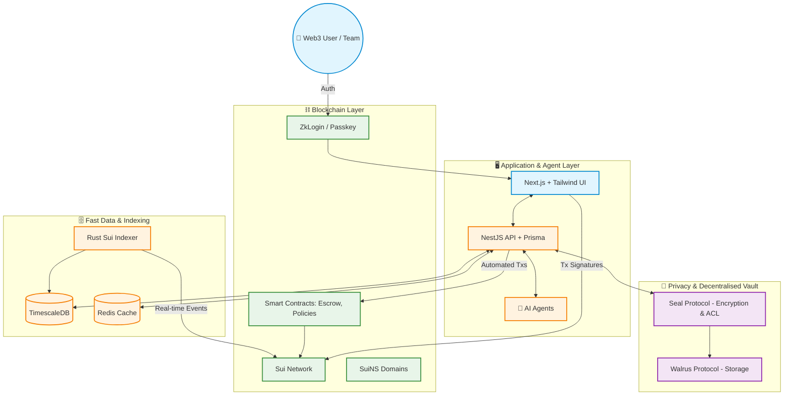

# 🌐 ROSMAR Decentralised CRM

**Web3 Native Privacy-First Agentic CRM**

ROSMAR is an enterprise-grade Customer Relationship Management (CRM) platform purpose-built for the Web3 ecosystem. It bridges the gap between traditional Web2 premium experiences (like Salesforce and HubSpot) and Web3 native advantages. By treating wallet addresses as core identities, on-chain behaviour as real-time signals, and utilising smart contracts for automated value exchange, ROSMAR provides a unified, privacy-first, and agentic solution for Web3 brands, protocols, and DAOs.

---

## 🏗 System Architecture

The following diagram illustrates how ROSMAR seamlessly integrates off-chain application layers with on-chain data and privacy protocols:

---

## ✨ Core Features

### 1. 🪪 Unified Web3 Identity
Resolve the identity fragmentation of Web2 CRMs by aggregating multi-chain wallets (Sui, EVM, Solana), DID/domains (SuiNS, ENS), and social links into a single 360-degree profile. Real-time net worth tracking and NFT gallery views are built-in, supporting ZkLogin and Passkey for seamless, passwordless onboarding.

### 2. 📊 On-chain Customer Data Platform (CDP)
Transform on-chain actions into actionable marketing signals.
*   **Real-time Event Indexer:** Instantly track NFT mints, DeFi interactions (swaps, staking), and governance voting.
*   **Web3 Engagement Score:** Customisable scoring based on holding time, transaction value, and voting activity to easily identify whales and active contributors.

### 3. 🤖 Intelligent Web3 Agents
Go beyond automated communication with agents capable of executing on-chain value transfers.
*   **AI Analyst Agent:** Generate data reports and segmentation strategies using natural language queries.
*   **On-chain Action Agent:** Automate airdrops, gas sponsorship, or treasury operations based on user behaviour (subject to human approval for execution).
*   **Content Agent:** Automatically generate personalised marketing copy tailored to a user's on-chain tags (e.g., "DeFi Degen").

### 4. ⚡️ Dynamic Segmentation & Marketing Automation
Build visual workflows to automate your Web3 campaigns.
*   **Smart Segments & Lookalike Audiences:** Automatically update user lists based on dynamic rules and on-chain characteristics.
*   **Web3 Journey Builder:** Drag-and-drop workflows triggered by wallet connections, NFT mints, or token transfers to execute actions like granting Discord roles, sending Telegram messages, or airdropping tokens.
*   **Quest-to-Qualify (Q3):** Built-in task system requiring users to complete on-chain missions to unlock CRM benefits.

### 5. 🤝 Sales Pipeline & On-chain Deal Rooms
Manage B2B token deals and partnerships securely.
*   **Web3 Deal Structure:** Support for Token Vesting terms and SAFT templates.
*   **On-chain Deal Room & Escrow:** Access-gated deal rooms where only the buyer and seller can decrypt documents. Direct integration with smart contract escrow automates fund release upon deal completion.

### 6. 🛡️ Decentralised Privacy Vault
Maintain complete data sovereignty and eliminate single points of failure.
*   All sensitive data (private notes, contracts, KYC documents) is end-to-end encrypted using **Seal** and stored decentrally on **Walrus**.
*   Granular, role-based access control (RBAC) is defined and enforced directly via Sui smart contracts.

---

## 🛠 Technology Stack

*   **⛓️ Blockchain Layer:** Sui Network (Object-based data model, ZkLogin, SuiNS)
*   **🗄️ Storage Layer:** Walrus Protocol (Decentralised storage for large files and historical data)
*   **🔐 Privacy Layer:** Seal (Client-side encryption and TEE-based access control)
*   **💻 Application Layer:** Next.js, React, Tailwind CSS, Shadcn UI
*   **⚙️ Backend & Data:** NestJS, Prisma, TimescaleDB, Redis, Custom Rust/Sui Indexer

---

## 🚀 Roadmap

*   **Phase 1: The "On-chain Hub" (MVP) ✅** - Wallet-first login, unified profiles, basic segmentation, sales pipeline, and privacy vault.
*   **Phase 2: The "Autonomy Engine" (Growth) ⏳** - Dashboard templates, journey builder, deep social integrations (Telegram/Discord), AI agents, API productisation, and advanced deal rooms.
*   **Phase 3: The "Ecosystem Platform" (Scale) 🚀** - Open APIs, plugin marketplace, mobile app with biometric signatures, and Data DAO functionalities.

---

## 🔒 Security & Compliance

ROSMAR is designed with enterprise-grade security and compliance in mind, featuring non-custodial data encryption where the platform holds no decryption keys. It natively supports GDPR's "Right to be Forgotten" through key destruction capabilities, and ensures all access logs and permission changes are auditable on-chain.
