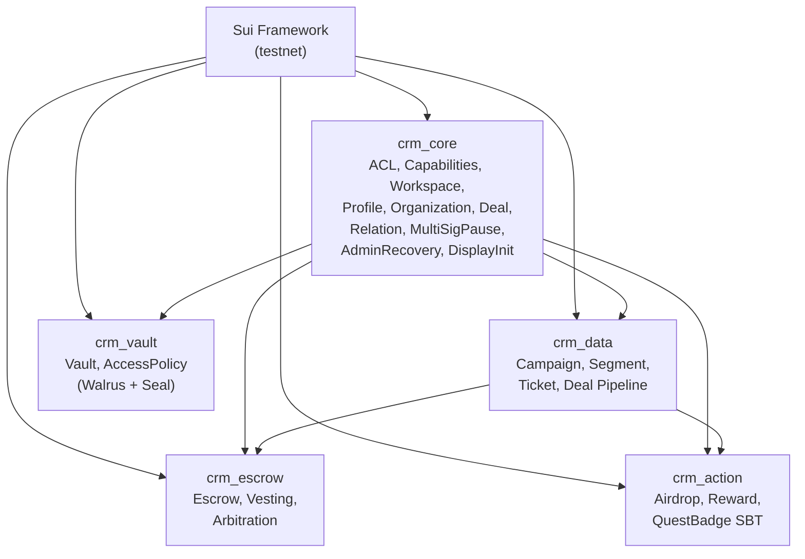
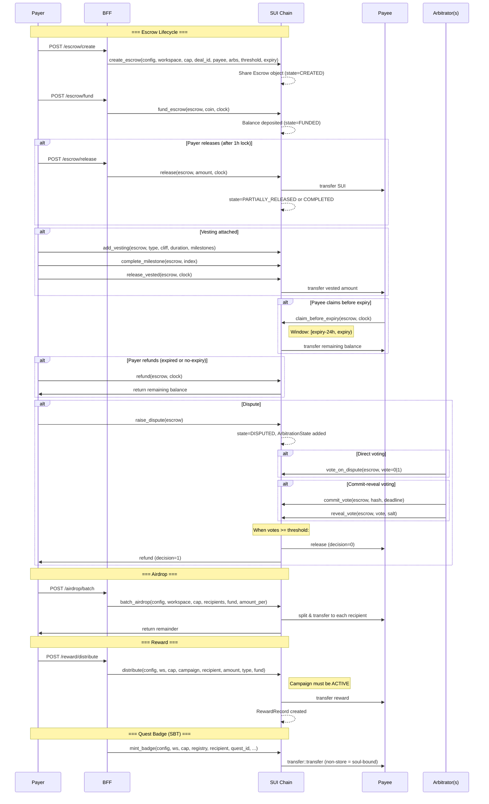
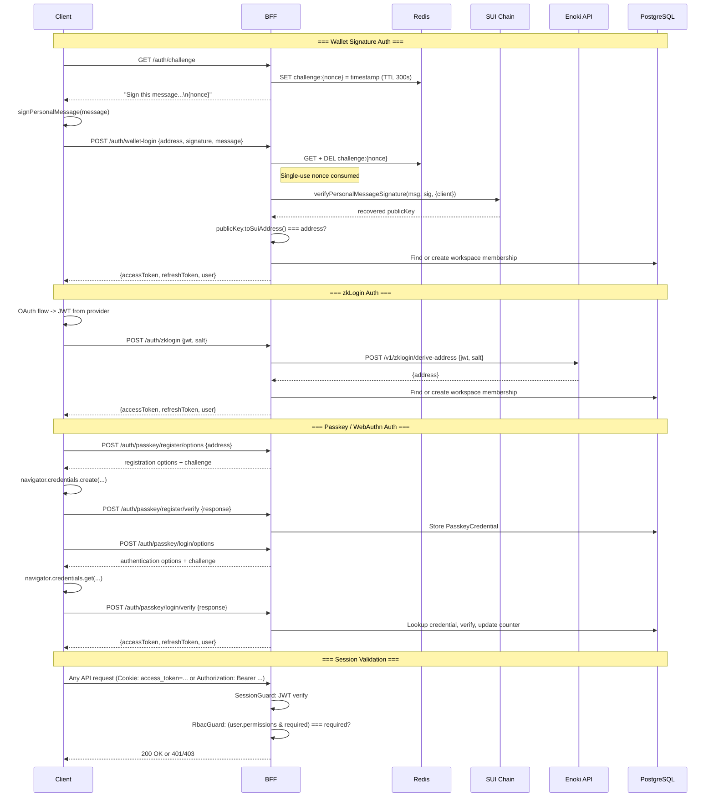
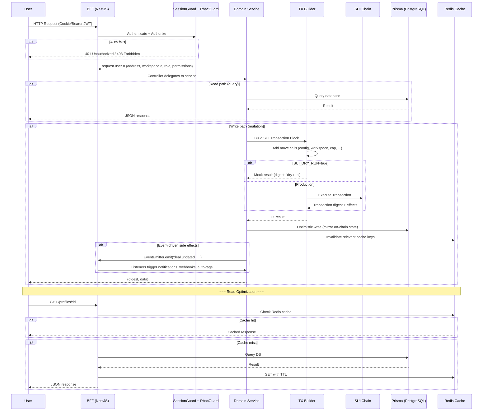

# ROSMAR CRM Architecture

> Last updated: 2026-03-10

## 1. Move Package Dependency Graph

`crm_core` is the foundation layer: it defines the capability model (`WorkspaceAdminCap`, `EmergencyPauseCap`, `GlobalConfig`), ACL bitmask system, and all core CRM objects. Every other package depends on it for pause checks and workspace authorization. `crm_data` adds campaign/segment/ticket data structures. `crm_escrow` and `crm_action` both depend on `crm_core` and `crm_data` because they reference workspace authorization and campaign objects respectively. `crm_vault` depends only on `crm_core` since it operates independently of campaign/deal data.

---

## 2. BFF Module Graph

```mermaid
graph TD
    APP["AppModule"]

    subgraph Infrastructure
        CONFIG["ConfigModule<br/>(global)"]
        EVENT["EventEmitterModule"]
        THROTTLE["ThrottleConfig<br/>+ ThrottlerGuard"]
        PRISMA["PrismaModule<br/>(global)"]
        CACHE["CacheModule<br/>(Redis)"]
        HEALTH["HealthModule"]
        LOG["LoggingModule<br/>(pino)"]
    end

    subgraph Auth
        AUTH["AuthModule<br/>SessionGuard, RbacGuard,<br/>WalletStrategy, ZkLoginStrategy"]
        TESTAUTH["TestAuthModule<br/>(NODE_ENV=test only)"]
    end

    subgraph Core Domain
        WS["WorkspaceModule"]
        PROF["ProfileModule"]
        ORG["OrganizationModule"]
        DEAL["DealModule"]
        SEG["SegmentModule"]
    end

    subgraph Extended Domain
        CAMP["CampaignModule"]
        VAULT["VaultModule"]
        TICKET["TicketModule"]
        QUEST["QuestModule"]
    end

    subgraph Actions & Comms
        MSG["MessagingModule"]
        NOTIF["NotificationModule"]
        WEBHOOK["WebhookModule"]
        BROADCAST["BroadcastModule"]
        ENGAGE["EngagementModule"]
        AUTOTAG["AutoTagModule"]
        SOCIAL["SocialModule"]
    end

    subgraph Intelligence
        AGENT["AgentModule<br/>(AI SDK)"]
        ANALYTICS["AnalyticsModule"]
    end

    subgraph Compliance
        GDPR["GdprModule<br/>(BullMQ jobs)"]
    end

    APP --> CONFIG
    APP --> EVENT
    APP --> THROTTLE
    APP --> PRISMA
    APP --> CACHE
    APP --> HEALTH
    APP --> LOG
    APP --> AUTH
    APP -.-> TESTAUTH
    APP --> WS
    APP --> PROF
    APP --> ORG
    APP --> DEAL
    APP --> SEG
    APP --> CAMP
    APP --> VAULT
    APP --> TICKET
    APP --> QUEST
    APP --> MSG
    APP --> NOTIF
    APP --> WEBHOOK
    APP --> BROADCAST
    APP --> ENGAGE
    APP --> AUTOTAG
    APP --> SOCIAL
    APP --> AGENT
    APP --> ANALYTICS
    APP --> GDPR
```

The `AppModule` registers a global `ThrottlerGuard` as `APP_GUARD`, meaning every endpoint is rate-limited by default. `PrismaModule` and `ConfigModule` are global -- available to all modules without explicit imports. `CacheModule` wraps Redis via `ioredis` and is used by `AuthService` for challenge nonce storage. `TestAuthModule` is conditionally loaded only when `NODE_ENV=test`, providing a bypass login endpoint.

---

## 3. Fund Flow Diagram

The escrow module is the primary fund custody mechanism. Funds enter via `fund_escrow` and can only exit through four paths: payer-initiated `release` (with 1-hour minimum lock), payee `claim_before_expiry` (24h window), payer `refund` (after expiry or if no expiry set), or arbitration dispute resolution. The 1-hour lock prevents immediate release after funding. Vesting adds time-based or milestone-based release schedules on top of the funded escrow.

Airdrops and rewards are stateless fund transfers -- SUI is split from a provided coin and transferred immediately. No fund custody is involved beyond the transaction itself.

---

## 4. Auth Flow

Three authentication paths converge on the same `resolveOrCreateMembership` function, which either finds the user's existing workspace membership or auto-provisions a new workspace with owner role. JWT tokens embed `address`, `workspaceId`, `role`, and `permissions`. The `SessionGuard` extracts JWT from httpOnly cookie or Authorization header. The `RbacGuard` enforces bitmask permissions matching the on-chain ACL model.

Key security properties:
- Challenge nonces are single-use (Redis GET + DEL)
- Challenge TTL is 5 minutes
- Wallet signature verification uses SUI SDK `verifyPersonalMessageSignature` which handles zkLogin JWK verification
- Recovered address must match claimed address
- WebAuthn counters are incremented to prevent replay
- Refresh tokens have configurable expiry (default 7d)

---

## 5. Data Flow

The write path follows a pattern of: (1) build SUI transaction with capability objects, (2) execute on-chain, (3) mirror state into PostgreSQL via Prisma for fast reads. This dual-write approach means the on-chain state is the source of truth, while PostgreSQL serves as a read-optimized cache. The `SUI_DRY_RUN=true` flag enables testing without chain interaction.

Key architectural properties:
- **Global ThrottlerGuard** -- every endpoint is rate-limited at the BFF level
- **ValidationPipe whitelist** -- unknown request fields are stripped before reaching controllers
- **Optimistic concurrency** -- on-chain objects carry `version` fields; BFF passes `expected_version` to prevent stale writes
- **Event-driven side effects** -- `EventEmitterModule` decouples mutations from notification/webhook/auto-tag logic
- **CORS credentials mode** -- `CORS_ORIGIN` is required in production; cookies are sent with `credentials: true`
- **BullMQ async jobs** -- GDPR deletion, export, and cleanup run as background jobs via Redis-backed queues
