# ROSMAR CRM — STRIDE Threat Model

**Version:** 1.0
**Date:** 2026-03-10
**Scope:** On-chain Move contracts (crm_core, crm_data, crm_escrow, crm_vault, crm_action) + BFF (NestJS)

---

## 1. System Overview

ROSMAR CRM is a decentralised CRM built on the SUI blockchain. It manages customer profiles, organisations, deals, campaigns, support tickets, escrow payments, encrypted vault storage, and token distribution (airdrops/rewards/quest badges).

### Components

| Layer | Component | Purpose |
|-------|-----------|---------|
| **On-chain** | `crm_core` | Workspace, Profile, Organization, Relation, Deal, ACL, Capabilities, GlobalConfig, MultiSigPause, AdminRecovery |
| **On-chain** | `crm_data` | Campaign, Segment, Ticket, Deal (pipeline v2) |
| **On-chain** | `crm_escrow` | Escrow (fund lock/release/refund), Vesting (linear/milestone), Arbitration (commit-reveal voting) |
| **On-chain** | `crm_vault` | Vault (encrypted file/note storage via Walrus+Seal), AccessPolicy (workspace/address/role-based decryption) |
| **On-chain** | `crm_action` | Airdrop (batch SUI distribution), Reward (campaign-linked distribution), QuestBadge (SBT minting) |
| **Off-chain** | BFF (NestJS) | REST API, JWT auth (wallet sig + zkLogin + passkey), RBAC, webhook ingestion, GDPR executor, rate limiting, caching |
| **Off-chain** | PostgreSQL | Prisma ORM, optimistic write-through for on-chain state |
| **Off-chain** | Redis | Challenge nonce store, cache layer, rate limit backing |
| **External** | SUI Indexer | Pushes on-chain events to BFF via HMAC-signed webhook |

---

## 2. Trust Boundaries

```mermaid
graph TB
    subgraph "Public Internet"
        Browser["User Browser / Wallet"]
        Indexer["SUI Indexer"]
    end

    subgraph "BFF (NestJS) — DMZ"
        API["REST API<br/>/api/*"]
        WH["Webhook Endpoint<br/>/api/webhooks/indexer-event"]
        Auth["AuthService<br/>JWT + Wallet Sig + zkLogin + Passkey"]
        RBAC["SessionGuard + RbacGuard"]
        Throttle["ThrottlerModule<br/>global:100/min, auth:10/min, gdpr:3/10min"]
        Logging["Pino Logger<br/>redact: auth headers, secrets, PII"]
        GDPR["GdprExecutorService<br/>PII erasure"]
    end

    subgraph "Data Stores"
        PG["PostgreSQL<br/>(TimescaleDB pg16)"]
        Redis["Redis 7<br/>challenges, cache"]
    end

    subgraph "SUI Blockchain"
        GlobalConfig["GlobalConfig<br/>(shared, pause switch)"]
        Workspace["Workspace<br/>(shared)"]
        Escrow["Escrow<br/>(shared, holds SUI)"]
        Vault["Vault<br/>(owned by workspace admin)"]
        Policy["AccessPolicy<br/>(owned)"]
        Caps["WorkspaceAdminCap<br/>EmergencyPauseCap"]
    end

    subgraph "External Services"
        Walrus["Walrus<br/>blob storage"]
        Seal["Seal<br/>encryption key server"]
        Enoki["Enoki<br/>zkLogin address derivation"]
    end

    Browser -->|"① HTTPS + JWT"| API
    API -->|"② Prisma"| PG
    API -->|"③ challenge/cache"| Redis
    API -->|"④ TX signing"| Escrow
    API -->|"④ TX signing"| Workspace
    Indexer -->|"⑤ HMAC-signed POST"| WH
    API -.->|"Walrus upload"| Walrus
    API -.->|"Seal decrypt"| Seal
    Auth -.->|"zkLogin derive"| Enoki

    style Browser fill:#f9f,stroke:#333
    style Indexer fill:#ff9,stroke:#333
    style Escrow fill:#f66,stroke:#333
    style Caps fill:#f66,stroke:#333
```

### Trust Boundary Summary

| Boundary | From | To | Auth Mechanism |
|----------|------|----|---------------|
| TB-1 | User browser | BFF API | JWT (wallet signature / zkLogin / passkey) |
| TB-2 | BFF | SUI blockchain | TX signing (BFF holds operator keypair) |
| TB-3 | BFF | PostgreSQL | Prisma connection string (env var) |
| TB-4 | BFF | Redis | Connection string (env var) |
| TB-5 | SUI Indexer | BFF webhook | HMAC-SHA256 (`x-webhook-signature`) |
| TB-6 | User | Seal key server | `seal_approve` entry function on-chain |

---

## 3. STRIDE Analysis

### 3.1 Spoofing

| ID | Threat | Component | Severity | Details |
|----|--------|-----------|----------|---------|
| S-1 | **Wallet signature bypass** | `AuthService.walletLogin()` | Critical | Attacker submits forged signature to impersonate another wallet address. Mitigated by `verifyPersonalMessageSignature` with SUI client verification + challenge nonce consumption (Redis, single-use, 5-min TTL). |
| S-2 | **JWT token forgery** | `AuthModule` (JwtModule) | Critical | Attacker forges JWT to gain access. Mitigated by HS256 signing with `JWT_SECRET` env var (required, fails at boot if missing). Access token TTL 15m, refresh token TTL 7d. |
| S-3 | **Cross-workspace identity spoofing** | `WorkspaceAdminCap` | High | Attacker uses a `WorkspaceAdminCap` from Workspace-A to act on Workspace-B. Mitigated on-chain by `assert_cap_matches(cap, workspace_id)` in every mutating function across all modules. |
| S-4 | **Challenge replay** | `AuthService.consumeChallenge()` | High | Attacker replays a used challenge nonce. Mitigated by immediate Redis `evict()` after first use (single-use nonce). |
| S-5 | **zkLogin identity spoofing** | `AuthService.zkLogin()` | High | Attacker provides malicious JWT+salt to derive wrong address. Mitigated by Enoki API server-side derivation (trusted external service). |
| S-6 | **Webhook impersonation** | `WebhookSignatureGuard` | High | Attacker sends fake indexer events. Mitigated by HMAC-SHA256 verification with `WEBHOOK_SECRET`, timing-safe comparison. |
| S-7 | **Passkey credential theft** | `AuthService.verifyPasskeyAuthentication()` | Medium | Attacker registers rogue passkey. Registration requires prior wallet auth; authentication verifies RP origin/ID and counter increment. |

### 3.2 Tampering

| ID | Threat | Component | Severity | Details |
|----|--------|-----------|----------|---------|
| T-1 | **On-chain state manipulation** | All Move modules | Critical | Direct on-chain calls bypass BFF. Every entry function requires `WorkspaceAdminCap` (owned object) + `GlobalConfig` (pause check). Capability-based access prevents unauthorized mutation. |
| T-2 | **BFF request body tampering** | `main.ts` | Medium | Malformed payloads. Mitigated by `ValidationPipe({ whitelist: true, transform: true })` globally — strips unknown fields and validates DTOs. |
| T-3 | **Escrow fund manipulation** | `escrow.move` | Critical | Payer/payee role confusion. `release()` asserts `ctx.sender() == escrow.payer`; `claim_before_expiry()` asserts `ctx.sender() == escrow.payee`. State machine prevents double-release (explicit state transitions: CREATED->FUNDED->PARTIALLY_RELEASED->COMPLETED). |
| T-4 | **Optimistic-lock bypass** | All CRUD modules | Medium | Concurrent edits causing lost updates. Mitigated by `version` field + `assert!(obj.version == expected_version)` on every update/archive. |
| T-5 | **Arbitration vote tampering** | `escrow.move` (commit-reveal) | High | Arbitrator changes vote after seeing others. Mitigated by commit-reveal scheme: `commit_vote()` stores `keccak256(vote || salt)`, `reveal_vote()` verifies hash match before recording vote. |
| T-6 | **Webhook body tampering** | `WebhookSignatureGuard` | Medium | MITM modifies event payload. HMAC-SHA256 over `JSON.stringify(req.body)` detects any modification. Uses `timingSafeEqual` to prevent timing attacks. |
| T-7 | **Vesting schedule manipulation** | `escrow.move` | High | Payer modifies vesting after setup. `add_vesting()` asserts `!escrow.has_vesting` (one-time attachment). Milestone percentages validated to sum to 10000 bp. |

### 3.3 Repudiation

| ID | Threat | Component | Severity | Details |
|----|--------|-----------|----------|---------|
| R-1 | **On-chain TX history** | SUI blockchain | Low | All state changes emit `AuditEventV1` events (version, workspace_id, actor, action, object_type, object_id, timestamp). Immutable and indexed. |
| R-2 | **Audit log gaps in BFF** | `LoggingModule` (pino) | Medium | BFF operations not logged to immutable store. Pino structured logging captures request/response, but logs are ephemeral (stdout). **Gap:** No persistent audit trail for off-chain admin actions (GDPR deletions, workspace provisioning). |
| R-3 | **Escrow dispute non-repudiation** | `escrow.move` | Low | All dispute actions emit typed events: `DisputeRaised`, `DisputeVoteCast`, `DisputeResolved` with actor address and timestamp. |
| R-4 | **GDPR deletion audit** | `GdprExecutorService` | Medium | Deletion logs tracked via `gdprDeletionLog` table (status: PENDING->EXECUTED with timestamp). Provides compliance evidence. |

### 3.4 Information Disclosure

| ID | Threat | Component | Severity | Details |
|----|--------|-----------|----------|---------|
| I-1 | **Vault secret leakage** | `crm_vault` | Critical | Vault stores `walrus_blob_id` + `seal_policy_id` on-chain (references, not plaintext). Actual content encrypted via Seal + Walrus. Decryption requires passing `seal_approve()` which checks policy rules. |
| I-2 | **Log PII exposure** | `LoggingModule` | High | Sensitive fields redacted: `req.headers.authorization`, `req.headers.cookie`, `req.body.encryptedData`, `req.body.privateKey`, `req.body.secret`, `req.body.password`, `req.body.seedPhrase`, `req.body.mnemonic`. |
| I-3 | **Cross-workspace data access** | All Move modules | High | Every object carries `workspace_id`. Mutations require matching `WorkspaceAdminCap`. Reads of shared objects visible on-chain but contain no secret data (encrypted content in Walrus). |
| I-4 | **Seal policy bypass (RULE_WORKSPACE_MEMBER / RULE_ROLE_BASED)** | `policy.move` `seal_approve()` | High | For `RULE_WORKSPACE_MEMBER` and `RULE_ROLE_BASED` policies, on-chain `seal_approve()` allows all callers — membership/role enforcement is off-chain (BFF). An attacker who knows the policy ID could call `seal_approve()` directly to decrypt vault content. **Partially mitigated:** Seal key server requires on-chain approval, but the approval is permissive for these rule types. |
| I-5 | **JWT payload leakage** | `AuthService` | Medium | JWT contains `address`, `workspaceId`, `role`, `permissions`. Not encrypted (HS256 signed only). Exposed via browser storage. Mitigated by short TTL (15m). |
| I-6 | **CORS misconfiguration** | `main.ts` | Medium | Production requires `CORS_ORIGIN` env var (throws if missing). Dev defaults to `localhost:3000`. Credentials enabled. |

### 3.5 Denial of Service

| ID | Threat | Component | Severity | Details |
|----|--------|-----------|----------|---------|
| D-1 | **BFF endpoint flooding** | `ThrottleConfig` | Medium | Rate limits: global 100/min, auth 10/min, AI 20/min, GDPR 3/10min. Backed by `@nestjs/throttler`. |
| D-2 | **On-chain gas exhaustion** | All entry functions | Medium | Attacker sends many TXs to exhaust workspace admin's gas. Mitigated by per-workspace on-chain rate limiting (`RateLimitConfig`, `PerUserRateLimit` in `capabilities.move`). |
| D-3 | **Rate limit bypass** | `capabilities.move` | Medium | On-chain rate limits are per-epoch (SUI epoch ~24h). A burst within a single epoch could exhaust the limit. Per-user rate limit adds granularity. |
| D-4 | **Airdrop gas bomb** | `airdrop.move` | Medium | `batch_airdrop()` iterates over `recipients.length()` — large arrays cause high gas. No on-chain cap on array size. BFF should enforce max batch size. |
| D-5 | **Global pause as DoS** | `EmergencyPauseCap` | High | Holder of `EmergencyPauseCap` can pause entire system. Mitigated by `multi_sig_pause` module requiring threshold of voters. Single-cap pause is deployer-only. |
| D-6 | **Escrow shared object contention** | `escrow.move` | Low | Escrow is a shared object — concurrent TXs may fail with contention. Standard SUI behavior, not a vulnerability per se. |

### 3.6 Elevation of Privilege

| ID | Threat | Component | Severity | Details |
|----|--------|-----------|----------|---------|
| E-1 | **WorkspaceAdminCap theft/misuse** | `capabilities.move` | Critical | Cap has `key + store` — can be transferred. If an admin transfers their cap to an attacker, the attacker gains full workspace control. Mitigated by: (a) admin_recovery allows only workspace owner to mint new caps; (b) cap is an owned object (not shared). |
| E-2 | **Cross-workspace capability attack** | All modules | Critical | Using Cap-A on Workspace-B. Mitigated by `assert_cap_matches(cap, workspace_id)` — every function checks cap.workspace_id matches the target workspace. |
| E-3 | **EmergencyPauseCap abuse** | `capabilities.move` | High | Single-holder can pause/unpause at will. Mitigated by `multi_sig_pause` module (threshold voting). Emergency single-cap pause reserved for deployer address. |
| E-4 | **Admin recovery abuse** | `admin_recovery.move` | High | Anyone could try to call `recover_admin_cap()`. Mitigated by `assert!(workspace::owner(workspace) == ctx.sender())` — only the original workspace owner can recover. |
| E-5 | **Profile `update_tier_and_score` unguarded** | `profile.move` | Medium | `update_tier_and_score()` has no `WorkspaceAdminCap` check — any caller with a mutable reference to the Profile object can modify tier/score. Mitigated by Profile being an owned object (only owner has mutable access). |
| E-6 | **BFF testLogin in production** | `AuthService.testLogin()` | Critical | Bypasses signature verification entirely. Must only be available when `NODE_ENV=test` (controlled by `TestAuthModule` loading). If exposed in production, any address can authenticate without wallet ownership proof. |
| E-7 | **Custom role escalation** | `acl.move` | Medium | `custom_role(level, permissions)` allows arbitrary role creation. On-chain this is just a struct constructor — access control depends on who calls the workspace functions with the resulting role. Workspace admin controls role assignment via `add_member()`. |

---

## 4. Attack Surface Inventory

### 4.1 Move Entry Functions

#### crm_core

| Module | Function | Access Control | Shared Objects |
|--------|----------|---------------|----------------|
| `capabilities` | `init()` | Package publish only | Creates `GlobalConfig` (shared) |
| `capabilities` | `pause()` | `EmergencyPauseCap` | `GlobalConfig` (mut) |
| `capabilities` | `unpause()` | `EmergencyPauseCap` | `GlobalConfig` (mut) |
| `capabilities` | `check_rate_limit()` | Any (consumes rate) | `RateLimitConfig` (mut) |
| `capabilities` | `check_user_rate_limit()` | Any (consumes rate) | `PerUserRateLimit` (mut) |
| `workspace` | `create()` | Any authenticated (pause check) | `GlobalConfig` (ref) |
| `workspace` | `add_member()` | `WorkspaceAdminCap` | `GlobalConfig` (ref), `Workspace` (mut) |
| `workspace` | `remove_member()` | `WorkspaceAdminCap` | `GlobalConfig` (ref), `Workspace` (mut) |
| `profile` | `create()` | `WorkspaceAdminCap` | `GlobalConfig` (ref), `Workspace` (ref) |
| `profile` | `update_tier_and_score()` | **None (owned object)** | None |
| `profile` | `archive()` | `WorkspaceAdminCap` | `GlobalConfig` (ref), `Workspace` (ref) |
| `profile` | `add_wallet()` | `WorkspaceAdminCap` | `GlobalConfig` (ref), `Workspace` (ref) |
| `profile` | `set_metadata()` | `WorkspaceAdminCap` | `GlobalConfig` (ref), `Workspace` (ref) |
| `organization` | `create()` | `WorkspaceAdminCap` | `GlobalConfig` (ref), `Workspace` (ref) |
| `organization` | `update_name()` | `WorkspaceAdminCap` | `GlobalConfig` (ref), `Workspace` (ref) |
| `organization` | `archive()` | `WorkspaceAdminCap` | `GlobalConfig` (ref), `Workspace` (ref) |
| `organization` | `set_metadata()` | `WorkspaceAdminCap` | `GlobalConfig` (ref), `Workspace` (ref) |
| `relation` | `create()` | `WorkspaceAdminCap` | `GlobalConfig` (ref), `Workspace` (ref) |
| `relation` | `update_type()` | `WorkspaceAdminCap` | `GlobalConfig` (ref), `Workspace` (ref) |
| `relation` | `archive()` | `WorkspaceAdminCap` | `GlobalConfig` (ref), `Workspace` (ref) |
| `deal` | `create_deal()` | `WorkspaceAdminCap` | `GlobalConfig` (ref), `Workspace` (ref) |
| `deal` | `update_deal()` | `WorkspaceAdminCap` | `GlobalConfig` (ref), `Workspace` (ref) |
| `deal` | `archive_deal()` | `WorkspaceAdminCap` | `GlobalConfig` (ref), `Workspace` (ref) |
| `multi_sig_pause` | `create_proposal()` | Must be in voters list | None (returns owned) |
| `multi_sig_pause` | `vote()` | Must be in voters list | `GlobalConfig` (mut), `PauseProposal` (mut) |
| `admin_recovery` | `recover_admin_cap()` | Workspace owner only | `GlobalConfig` (ref), `Workspace` (ref) |

#### crm_data

| Module | Function | Access Control | Shared Objects |
|--------|----------|---------------|----------------|
| `campaign` | `create()` | `WorkspaceAdminCap` | `GlobalConfig` (ref), `Workspace` (ref) |
| `campaign` | `launch()` | `WorkspaceAdminCap` | `GlobalConfig` (ref), `Workspace` (ref) |
| `campaign` | `pause()` | `WorkspaceAdminCap` | `GlobalConfig` (ref), `Workspace` (ref) |
| `campaign` | `complete()` | `WorkspaceAdminCap` | `GlobalConfig` (ref), `Workspace` (ref) |
| `segment` | `create()` | `WorkspaceAdminCap` | `GlobalConfig` (ref), `Workspace` (ref) |
| `segment` | `update_rule_hash()` | `WorkspaceAdminCap` | `GlobalConfig` (ref), `Workspace` (ref) |
| `segment` | `update_member_count()` | `WorkspaceAdminCap` | `GlobalConfig` (ref), `Workspace` (ref) |
| `ticket` | `create()` | `WorkspaceAdminCap` | `GlobalConfig` (ref), `Workspace` (ref) |
| `ticket` | `transition_status()` | `WorkspaceAdminCap` | `GlobalConfig` (ref), `Workspace` (ref) |
| `ticket` | `assign()` | `WorkspaceAdminCap` | `GlobalConfig` (ref), `Workspace` (ref) |
| `deal` (v2) | `create()` | `WorkspaceAdminCap` | `GlobalConfig` (ref), `Workspace` (ref) |
| `deal` (v2) | `advance_stage()` | `WorkspaceAdminCap` | `GlobalConfig` (ref), `Workspace` (ref) |
| `deal` (v2) | `archive()` | `WorkspaceAdminCap` | `GlobalConfig` (ref), `Workspace` (ref) |

#### crm_escrow

| Module | Function | Access Control | Shared Objects |
|--------|----------|---------------|----------------|
| `escrow` | `create_escrow()` | `WorkspaceAdminCap` | `GlobalConfig` (ref), `Workspace` (ref) |
| `escrow` | `fund_escrow()` | Payer only | `Escrow` (mut) |
| `escrow` | `release()` | Payer only (+ time lock) | `Escrow` (mut) |
| `escrow` | `claim_before_expiry()` | Payee only (time-windowed) | `Escrow` (mut) |
| `escrow` | `refund()` | Payer only (expired/no-expiry) | `Escrow` (mut) |
| `escrow` | `add_vesting()` | Payer only | `Escrow` (mut) |
| `escrow` | `release_vested()` | Payer only | `Escrow` (mut) |
| `escrow` | `complete_milestone()` | Payer only | `Escrow` (mut) |
| `escrow` | `raise_dispute()` | Payer or Payee | `Escrow` (mut) |
| `escrow` | `vote_on_dispute()` | Arbitrator only | `Escrow` (mut) |
| `escrow` | `commit_vote()` | Arbitrator only | `Escrow` (mut) |
| `escrow` | `reveal_vote()` | Arbitrator only | `Escrow` (mut) |

#### crm_vault

| Module | Function | Access Control | Shared Objects |
|--------|----------|---------------|----------------|
| `vault` | `create()` | `WorkspaceAdminCap` | `GlobalConfig` (ref), `Workspace` (ref) |
| `vault` | `set_blob()` | `WorkspaceAdminCap` | `GlobalConfig` (ref), `Workspace` (ref) |
| `vault` | `archive()` | `WorkspaceAdminCap` | `GlobalConfig` (ref), `Workspace` (ref) |
| `policy` | `create_workspace_policy()` | `WorkspaceAdminCap` | `GlobalConfig` (ref), `Workspace` (ref) |
| `policy` | `create_address_policy()` | `WorkspaceAdminCap` | `GlobalConfig` (ref), `Workspace` (ref) |
| `policy` | `create_role_policy()` | `WorkspaceAdminCap` | `GlobalConfig` (ref), `Workspace` (ref) |
| `policy` | `add_address()` | `WorkspaceAdminCap` | `GlobalConfig` (ref), `Workspace` (ref) |
| `policy` | `seal_approve()` | **Varies by rule type** (see I-4) | `AccessPolicy` (ref) |

#### crm_action

| Module | Function | Access Control | Shared Objects |
|--------|----------|---------------|----------------|
| `airdrop` | `batch_airdrop()` | `WorkspaceAdminCap` | `GlobalConfig` (ref), `Workspace` (ref) |
| `airdrop` | `batch_airdrop_variable()` | `WorkspaceAdminCap` | `GlobalConfig` (ref), `Workspace` (ref) |
| `reward` | `distribute()` | `WorkspaceAdminCap` | `GlobalConfig` (ref), `Workspace` (ref) |
| `reward` | `batch_distribute()` | `WorkspaceAdminCap` | `GlobalConfig` (ref), `Workspace` (ref) |
| `quest_badge` | `mint_badge()` | `WorkspaceAdminCap` | `GlobalConfig` (ref), `Workspace` (ref), `QuestRegistry` (mut) |

### 4.2 BFF REST Endpoints

| Endpoint | Auth | Rate Limit | Notes |
|----------|------|-----------|-------|
| `POST /api/auth/challenge` | None | auth: 10/min | Returns signed challenge nonce |
| `POST /api/auth/wallet-login` | Wallet signature | auth: 10/min | Consumes challenge, issues JWT |
| `POST /api/auth/zk-login` | JWT + salt (Enoki) | auth: 10/min | Derives address via Enoki |
| `POST /api/auth/passkey/*` | WebAuthn | auth: 10/min | Registration + authentication |
| `POST /api/auth/refresh` | Refresh token | auth: 10/min | Re-issues access token |
| `POST /api/auth/switch-workspace` | JWT | auth: 10/min | Verifies membership, re-issues |
| `POST /api/webhooks/indexer-event` | HMAC-SHA256 | global: 100/min | Processes on-chain events |
| `POST /api/gdpr/*` | JWT + RBAC | gdpr: 3/10min | PII erasure flow |
| All other `/api/*` | JWT + SessionGuard + RbacGuard | global: 100/min | Standard CRUD operations |

### 4.3 Admin Operations

| Operation | Mechanism | Risk |
|-----------|-----------|------|
| Emergency pause | `EmergencyPauseCap` (single holder) | Single point of control |
| Multi-sig pause | `PauseProposal` (threshold voting) | Requires voter collusion |
| Admin cap recovery | `admin_recovery::recover_admin_cap()` | Workspace owner only |
| GDPR deletion | `GdprExecutorService` | Irreversible PII erasure |

---

## 5. Mitigations Applied (P5 Fixes)

### Move Fixes (M1-M7)

| ID | Fix | Threats Addressed | Implementation |
|----|-----|-------------------|----------------|
| M-1 | **GlobalConfig pause guard** | T-1, D-5 | `assert_not_paused(config)` in every mutating entry function across all modules |
| M-2 | **WorkspaceAdminCap cross-workspace check** | S-3, E-2 | `assert_cap_matches(cap, workspace_id)` — every function that takes a cap validates it matches the target workspace |
| M-3 | **On-chain rate limiting** | D-2, D-3 | `RateLimitConfig` (per-workspace) + `PerUserRateLimit` (per-user-per-epoch) in `capabilities.move` |
| M-4 | **Escrow time-lock + state machine** | T-3 | `MIN_LOCK_DURATION_MS` (1h) on release, strict state transitions (CREATED->FUNDED->PARTIALLY/COMPLETED/REFUNDED/DISPUTED), claim window (24h before expiry) |
| M-5 | **Commit-reveal arbitration** | T-5 | `commit_vote()` stores keccak256 hash, `reveal_vote()` verifies hash, reveal deadline enforcement |
| M-6 | **Multi-sig pause** | E-3, D-5 | `multi_sig_pause::create_proposal()` + `vote()` with threshold, `set_paused()` is `public(package)` |
| M-7 | **Optimistic concurrency** | T-4 | `version` field + `assert!(obj.version == expected_version)` on every update/archive in profile, org, relation, deal, vault, policy, segment, ticket |

### BFF Fixes (B1-B9)

| ID | Fix | Threats Addressed | Implementation |
|----|-----|-------------------|----------------|
| B-1 | **Challenge nonce (single-use)** | S-1, S-4 | Redis-backed challenge with 5-min TTL, consumed on first use via `cacheService.evict()` |
| B-2 | **Wallet signature verification** | S-1 | `verifyPersonalMessageSignature` with SUI client (supports standard + zkLogin signatures), address binding check |
| B-3 | **JWT_SECRET required at boot** | S-2 | `AuthModule` throws if `JWT_SECRET` not set; 15-min access token, 7-day refresh token |
| B-4 | **HMAC webhook guard** | S-6, T-6 | `WebhookSignatureGuard` — HMAC-SHA256 with timing-safe comparison, `WEBHOOK_SECRET` via `getOrThrow()` |
| B-5 | **Global validation pipe** | T-2 | `ValidationPipe({ whitelist: true, transform: true })` strips unknown fields |
| B-6 | **Tiered rate limiting** | D-1 | `@nestjs/throttler`: global 100/min, auth 10/min, AI 20/min, GDPR 3/10min |
| B-7 | **PII log redaction** | I-2 | Pino `redact` config covers authorization headers, cookies, encrypted data, private keys, secrets, passwords, seed phrases, mnemonics |
| B-8 | **CORS enforcement** | I-6 | Production requires `CORS_ORIGIN` env var (throws if missing), credentials enabled |
| B-9 | **GDPR deletion executor** | R-4 | Transactional PII erasure: nullifies profile fields, deletes social links, segments, vault secrets, messages, workflow logs, deal documents; updates `gdprDeletionLog` |

### Red Team Test Coverage

| Test | Validates |
|------|-----------|
| Cross-workspace cap attack | M-2 (ECapMismatch abort) |
| Pause bypass attempt | M-1 (EPaused abort) |
| Rate limit exhaustion | M-3 (abort on exceeded) |
| Escrow double-release | M-4 (EInvalidStateTransition abort) |
| Escrow release before timelock | M-4 (EMinLockDuration abort) |
| Arbitration vote manipulation | M-5 (ERevealMismatch / EAlreadyVoted abort) |
| Replay challenge nonce | B-1 (rejected on second use) |
| Forged webhook signature | B-4 (401 Unauthorized) |
| Oversized request body | B-5 (stripped by whitelist) |

---

## 6. Residual Risks

### 6.1 Known Unmitigated Issues

| ID | Risk | Severity | Component | Details |
|----|------|----------|-----------|---------|
| RR-1 | **`release()` accepts `amount=0`** | Low | `escrow.move:416` | `assert!(amount <= balance::value(...))` passes when amount=0. This creates a no-op release that still emits `EscrowReleased` event with amount=0 and can transition state to `PARTIALLY_RELEASED`. Fix: add `assert!(amount > 0)`. |
| RR-2 | **Multi-token escrow not implemented** | Medium | `escrow.move` | Escrow only supports `SUI` type. No generic `Coin<T>` support. Cross-token deals require separate escrow instances. |
| RR-3 | **Quest badge revocation not implemented** | Medium | `quest_badge.move` | `QuestBadge` is an SBT (no `store` ability, cannot be transferred). But there is no `revoke_badge()` function — once minted, a badge cannot be burned or invalidated. Dedup registry entry persists forever. |
| RR-4 | **Seal policy permissive for workspace/role rules** | High | `policy.move:242-248` | `seal_approve()` for `RULE_WORKSPACE_MEMBER` and `RULE_ROLE_BASED` allows all callers through. On-chain enforcement is absent — relies entirely on BFF gating. An attacker bypassing BFF and calling `seal_approve()` directly on-chain could decrypt any vault content under these policy types. |
| RR-5 | **WebAuthn challenges in-memory** | Medium | `AuthService` | `webauthnChallenges` stored in a `Map<>` — lost on restart, not shared across instances. Horizontal scaling breaks passkey flows. Should migrate to Redis. |
| RR-6 | **No on-chain batch size limit for airdrops** | Medium | `airdrop.move` | `batch_airdrop()` and `batch_airdrop_variable()` have no upper bound on `recipients.length()`. Extremely large arrays could hit gas limits or be used for griefing. |
| RR-7 | **`update_tier_and_score()` lacks cap check** | Low | `profile.move:119` | No `WorkspaceAdminCap` required. Profile is an owned object, so only the Sui-level owner can call with `&mut`, but if the profile is wrapped or shared in the future, this becomes exploitable. |
| RR-8 | **Escrow arbitrator list not deduplicated** | Low | `escrow.move:306-311` | Arbitrator validation checks each is not payer/payee, but does not check for duplicate addresses in the list. A duplicate arbitrator could effectively lower the threshold. |
| RR-9 | **BFF audit trail not persistent** | Medium | `LoggingModule` | Pino logs to stdout. No persistent audit store for off-chain operations. Compliance-sensitive actions (GDPR, admin ops) should log to an append-only store. |
| RR-10 | **`testLogin()` exposure risk** | Critical | `AuthService` | If `TestAuthModule` is accidentally loaded in production, `testLogin()` allows auth bypass. Requires strict `NODE_ENV` gating at module registration level. |
